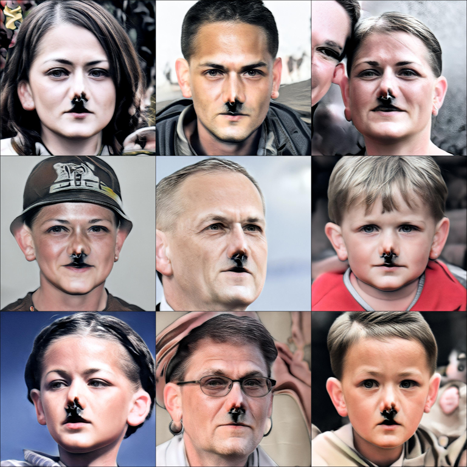

# StyleGAN-Nada

The paper StyleGAN-NADA presented by NVIDIA and Tel-Aviv University.

**Original Repository:** https://github.com/rinongal/StyleGAN-nada

**Original paper:** https://arxiv.org/abs/2108.00946

The generic idea of the paper is to use the capabilities of CLIP to transfer a Stylegan generator to another domain... **Without any data!**

CLIP is a zero-shot classifier that you can start to classify images without any training. Only you need: the image and the possible classes. CLIP model uses the power of multi-modal learning (text and image) to the image and possible labels into the same vector space. That’s allow to compare the image and text to determine which is the most appropriate label.

Finally, using the power of both models, we can create new crazy domains without any data allowing to generate: Zombies, Jokers, Comics even Hitler! This is terrifying!

It starts with an existing Stylegan generator model (FFHQ, Cars, or your custom model).

From here two generators are used, <u>GeneratorFrozen</u> guarantees to preserve the original latent space and its main characteristics.

The <u>GeneratorTrain</u> is initialized the same as the <u>GeneratorFrozen</u> but during training it will be conditioned with the <u>CombinedLoss</u> to adapt to the new domain.

The <u>CombinedLoss</u> has different components: texture, distance with respect to the original image, … **But the most relevant is the CLIP use.**

CLIP is a zero-shot classifier that you can start to classify images without any training. Only you need: the image and the possible classes. CLIP model uses the power of multi-modal learning (text and image) to the image and possible labels into the same vector space. That’s allow to compare the image and text to determine which is the most appropriate label.

Finally, using the power of both models, we can create new crazy domains without any data allowing to generate: Zombies, Jokers, Comics even Hitler! This is terrifying!

# Generated domains

## Zombie

## Joker

## Comic

## Disney

## Nazis

## Notes:

Running StyleGAN-Nothing, it is somewhat complicated. There are dependencies that complicate the process a bit.

Clone the original repo: https://github.com/rinongal/StyleGAN-nada

My advice is to do the following, create two enviroments:
* **env_convert**: It is in charge of converting the weights of the original stylegan2 network into tensorflow in the pytorch format. To do this, use tensorflow-gpu = 1.15, pytorch = 1.7.1 and python version 3.7. Install cuda version 10.0 and make sure you have access to nvcc and the dynamic libraries. You can based on my convert.sh

* **env**: It is in charge of doing the trainings, you can install the version you want of pytorch.